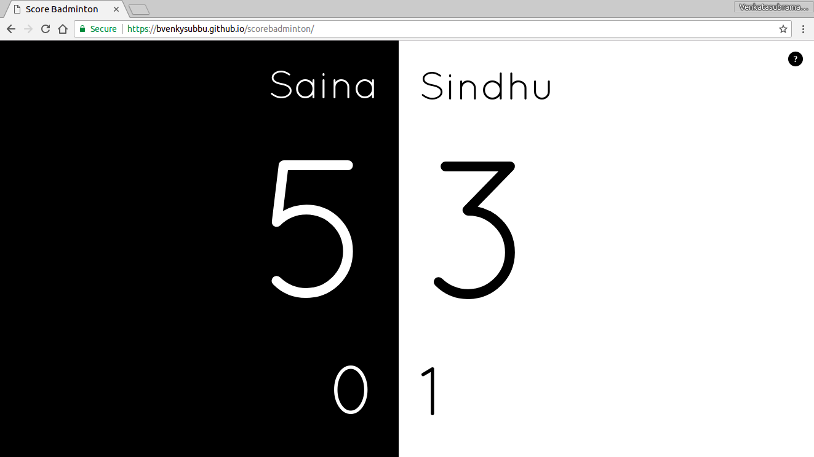

# scorebadminton
Simple Scoring App for a badminton matches

# use it directly/demo
https://bvenkysubbu.github.io/scorebadminton/

# installation
It is a front end only app. Just download the contents of the repository and open the index.html on a browser

# screenshot

# change the player/team name
Just click/tap the Player One/Player Two text.

# change the points
Increase by click/tap. Decrease by right click/long press.

# change games won
Increase by click/tap. Decrease by right click/long press.